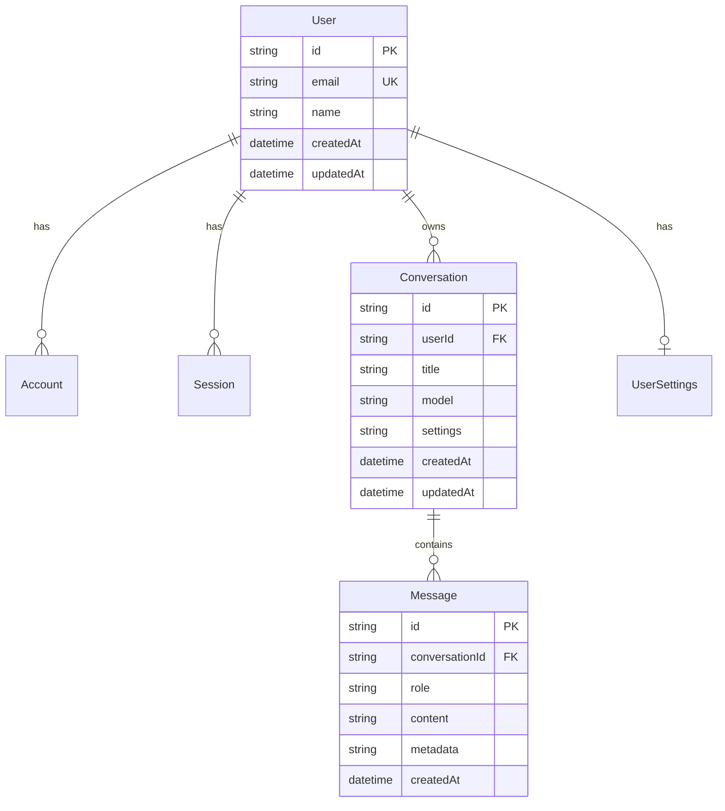
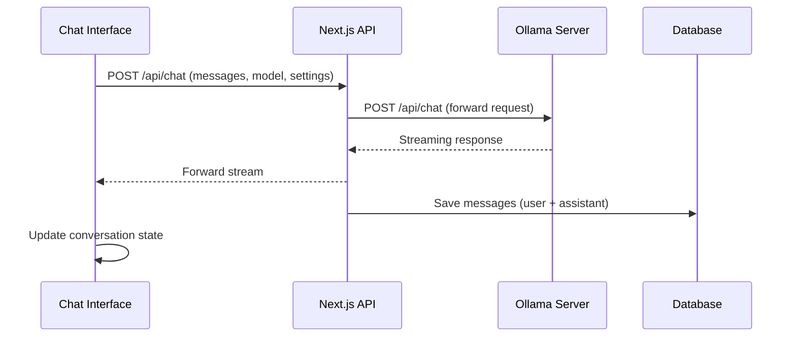
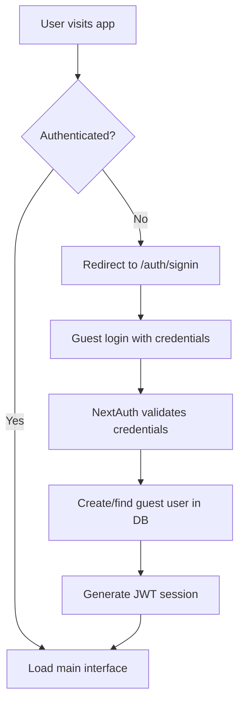
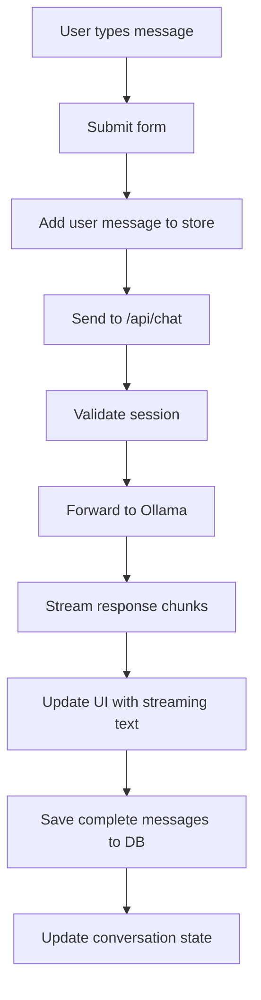
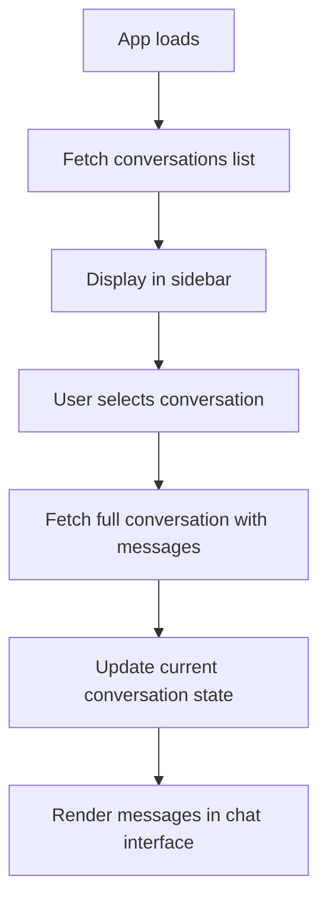

# Next.js Ollama Chat Application - Architecture Analysis & Testing Strategy

## Table of Contents
1. [Application Overview](#application-overview)
2. [Architecture Analysis](#architecture-analysis)
3. [Component Breakdown](#component-breakdown)
4. [Data Flow Analysis](#data-flow-analysis)
5. [Testing Strategy](#testing-strategy)
6. [Test Implementation Plan](#test-implementation-plan)

## Application Overview

This is a modern Next.js chat application that provides a web interface for interacting with Ollama AI models. The application features real-time streaming chat, conversation management, user authentication, and a responsive UI.

### Key Technologies
- **Frontend**: Next.js 15.1.8, React 19, TypeScript
- **Authentication**: NextAuth.js v5 (beta) with Prisma adapter
- **Database**: SQLite with Prisma ORM
- **State Management**: Zustand
- **UI Framework**: Tailwind CSS with Radix UI components
- **AI Integration**: Ollama API client
- **Build Tool**: Turbopack (Next.js)

## Architecture Analysis

### 1. **Application Structure**

```
src/
├── app/                          # Next.js App Router
│   ├── api/                      # API Routes
│   │   ├── auth/[...nextauth]/   # Authentication endpoints
│   │   ├── chat/                 # Chat streaming endpoint
│   │   ├── conversations/        # CRUD operations for conversations
│   │   └── models/               # Ollama model listing
│   ├── auth/signin/              # Authentication pages
│   ├── layout.tsx                # Root layout with providers
│   └── page.tsx                  # Main chat interface
├── components/                   # Reusable UI components
│   ├── chat/                     # Chat-specific components
│   ├── layout/                   # Layout components (header, sidebar)
│   ├── providers/                # Context providers
│   └── ui/                       # Base UI components
├── lib/                          # Utility libraries
│   ├── auth.ts                   # NextAuth configuration
│   ├── db.ts                     # Prisma client setup
│   ├── ollama-client.ts          # Ollama API client
│   └── utils.ts                  # Helper functions
├── stores/                       # State management
│   └── chat-store.ts             # Zustand chat store
└── types/                        # TypeScript definitions
    └── next-auth.d.ts            # NextAuth type extensions
```

### 2. **Database Schema**

The application uses a well-structured relational database with the following entities:

#### Core Tables
- **User**: User accounts with NextAuth integration
- **Account**: OAuth account linking (NextAuth)
- **Session**: User sessions (NextAuth)
- **VerificationToken**: Email verification (NextAuth)
- **Conversation**: Chat conversations with metadata
- **Message**: Individual chat messages
- **UserSettings**: User preferences and Ollama configuration

#### Key Relationships


### 3. **Authentication System**

- **Provider**: NextAuth.js with Credentials provider
- **Strategy**: JWT-based sessions
- **Demo Mode**: Guest user authentication (`guest@example.com` / `guest`)
- **Database Integration**: Prisma adapter for session persistence
- **Security**: Session callbacks for user ID injection

### 4. **API Architecture**

#### REST Endpoints
- `POST /api/auth/[...nextauth]` - Authentication handling
- `POST /api/chat` - Streaming chat with Ollama
- `GET/POST /api/conversations` - Conversation management
- `GET/PUT/DELETE /api/conversations/[id]` - Individual conversation operations
- `GET /api/models` - Available Ollama models

#### Key Features
- **Streaming Responses**: Real-time chat streaming using ReadableStream
- **Authentication Middleware**: Session validation on all protected routes
- **Error Handling**: Comprehensive error responses with proper HTTP status codes
- **Database Transactions**: Atomic message saving operations

### 5. **Frontend Architecture**

#### State Management (Zustand)
```typescript
interface ChatState {
  // Current conversation and list
  currentConversation: Conversation | null
  conversations: Conversation[]
  
  // Model and settings
  models: OllamaModel[]
  selectedModel: string
  temperature: number
  systemPrompt: string
  
  // UI state
  isLoading: boolean
  isStreaming: boolean
  sidebarOpen: boolean
  
  // Actions for state mutations
  setCurrentConversation: (conversation: Conversation | null) => void
  // ... other actions
}
```

#### Component Hierarchy
```
App Layout
├── SessionProvider (Authentication context)
├── Header (Navigation, user menu, settings)
├── Sidebar (Conversation list, new conversation)
└── ChatInterface (Message display, input, streaming)
    ├── MessageBubble (Individual message rendering)
    └── StreamingIndicator (Real-time typing indicator)
```

### 6. **Ollama Integration**

#### Client Architecture
- **Base URL Configuration**: Environment-based Ollama server URL
- **Streaming Support**: Real-time response streaming
- **Model Management**: Dynamic model listing and selection
- **Error Handling**: Connection status monitoring
- **Message Format**: OpenAI-compatible message structure

#### Communication Flow


## Component Breakdown

### 1. **Core Components**

#### ChatInterface (`src/components/chat/chat-interface.tsx`)
- **Purpose**: Main chat UI with message display and input
- **Key Features**:
  - Real-time message streaming
  - Message history rendering
  - Input handling with keyboard shortcuts
  - Auto-scrolling to latest messages
  - Streaming indicator during AI responses

#### Sidebar (`src/components/layout/sidebar.tsx`)
- **Purpose**: Conversation management and navigation
- **Key Features**:
  - Conversation list with metadata
  - New conversation creation
  - Conversation deletion
  - Real-time conversation switching

#### Header (`src/components/layout/header.tsx`)
- **Purpose**: Application navigation and user controls
- **Key Features**:
  - Sidebar toggle
  - Current model display
  - User authentication status
  - Settings access (placeholder)

### 2. **State Management**

#### Chat Store (`src/stores/chat-store.ts`)
- **Purpose**: Centralized state management for chat functionality
- **Responsibilities**:
  - Conversation state management
  - Model selection and settings
  - UI state (loading, streaming, sidebar)
  - Message operations (add, update)

### 3. **API Layer**

#### Chat API (`src/app/api/chat/route.ts`)
- **Purpose**: Proxy and enhance Ollama chat requests
- **Key Features**:
  - Authentication validation
  - Request forwarding to Ollama
  - Streaming response handling
  - Database persistence
  - Error handling and logging

#### Conversations API (`src/app/api/conversations/`)
- **Purpose**: CRUD operations for conversation management
- **Endpoints**:
  - `GET /` - List user conversations
  - `POST /` - Create new conversation
  - `GET /[id]` - Get conversation with messages
  - `PUT /[id]` - Update conversation metadata
  - `DELETE /[id]` - Delete conversation

## Data Flow Analysis

### 1. **Authentication Flow**


### 2. **Chat Message Flow**


### 3. **Conversation Management Flow**


## Testing Strategy

### 1. **Unit Testing**

#### **Utility Functions** (`src/lib/utils.ts`)
- **Test Coverage**:
  - `formatRelativeTime()` - Date formatting edge cases
  - `generateConversationTitle()` - Title truncation logic
  - `formatTokensPerSecond()` - Performance metric calculations
  - `cn()` - CSS class merging

#### **Ollama Client** (`src/lib/ollama-client.ts`)
- **Test Coverage**:
  - Connection establishment and validation
  - Message formatting and validation
  - Streaming response parsing
  - Error handling for network failures
  - Model listing and filtering

#### **State Management** (`src/stores/chat-store.ts`)
- **Test Coverage**:
  - State mutations (add/update/delete conversations)
  - Message operations (add/update messages)
  - UI state management (loading, streaming, sidebar)
  - State persistence and hydration

### 2. **Integration Testing**

#### **API Routes Testing**
- **Authentication API** (`/api/auth/[...nextauth]`)
  - Guest user authentication flow
  - Session creation and validation
  - JWT token generation and verification
  - Database user creation/retrieval

- **Chat API** (`/api/chat`)
  - Message streaming functionality
  - Ollama server communication
  - Database message persistence
  - Error handling for Ollama failures
  - Authentication middleware validation

- **Conversations API** (`/api/conversations`)
  - CRUD operations with proper authorization
  - Database transaction integrity
  - Message inclusion and pagination
  - User isolation (users can only access their conversations)

#### **Database Integration**
- **Prisma Operations**
  - User creation and retrieval
  - Conversation CRUD with proper relationships
  - Message persistence with metadata
  - Transaction rollback scenarios
  - Database constraint validation

### 3. **Component Testing**

#### **ChatInterface Component**
- **Functionality Tests**:
  - Message rendering with proper formatting
  - Real-time streaming display
  - Input validation and submission
  - Keyboard shortcut handling (Enter to send)
  - Auto-scrolling behavior
  - Loading and error states

#### **Sidebar Component**
- **Functionality Tests**:
  - Conversation list rendering
  - New conversation creation
  - Conversation selection and switching
  - Delete confirmation and execution
  - Loading states and error handling

#### **Header Component**
- **Functionality Tests**:
  - Sidebar toggle functionality
  - User information display
  - Sign-out functionality
  - Model selection display

### 4. **End-to-End Testing**

#### **Complete User Journeys**
- **Authentication Flow**
  - Landing on app → redirect to signin
  - Guest authentication → successful login
  - Session persistence across page refreshes
  - Logout functionality

- **Chat Functionality**
  - Create new conversation
  - Send first message and receive response
  - Continue conversation with context
  - Switch between conversations
  - Delete conversations

- **Real-time Features**
  - Message streaming display
  - Typing indicators
  - Real-time conversation updates
  - Connection error handling

#### **Cross-browser Testing**
- Chrome, Firefox, Safari, Edge compatibility
- Mobile responsiveness
- Touch interaction support
- WebSocket/streaming support

### 5. **Performance Testing**

#### **Frontend Performance**
- **Metrics to Monitor**:
  - First Contentful Paint (FCP)
  - Largest Contentful Paint (LCP)
  - Time to Interactive (TTI)
  - Bundle size optimization
  - Memory usage during long conversations

#### **API Performance**
- **Load Testing**:
  - Concurrent chat sessions
  - Message throughput
  - Database query performance
  - Streaming response latency

#### **Database Performance**
- **Query Optimization**:
  - Conversation listing with pagination
  - Message retrieval performance
  - Index effectiveness
  - Connection pooling efficiency

### 6. **Security Testing**

#### **Authentication Security**
- Session hijacking prevention
- JWT token validation
- CSRF protection
- Rate limiting on authentication endpoints

#### **API Security**
- Authorization validation on all protected routes
- Input sanitization and validation
- SQL injection prevention (Prisma ORM)
- XSS prevention in message content

#### **Data Privacy**
- User data isolation
- Conversation privacy between users
- Secure session management
- Environment variable security

## Test Implementation Plan

### Phase 1: Foundation Testing (Week 1)
1. **Setup Testing Infrastructure**
   - Configure Jest and React Testing Library
   - Setup test database (SQLite in-memory)
   - Configure Playwright for E2E testing
   - Setup test coverage reporting

2. **Unit Tests Implementation**
   - Utility functions testing
   - Ollama client testing
   - State management testing
   - Component unit tests

### Phase 2: Integration Testing (Week 2)
1. **API Route Testing**
   - Authentication flow testing
   - Chat API integration tests
   - Conversations API testing
   - Database integration tests

2. **Component Integration**
   - Chat interface with real API calls
   - Sidebar with conversation management
   - Authentication flow integration

### Phase 3: End-to-End Testing (Week 3)
1. **User Journey Testing**
   - Complete authentication flows
   - Full chat functionality
   - Conversation management
   - Error scenarios

2. **Cross-browser Testing**
   - Multi-browser compatibility
   - Mobile responsiveness
   - Performance across devices

### Phase 4: Performance & Security (Week 4)
1. **Performance Testing**
   - Load testing with multiple users
   - Memory leak detection
   - Bundle size optimization
   - Database performance tuning

2. **Security Testing**
   - Penetration testing
   - Authentication security audit
   - Data privacy validation
   - Input validation testing

### Testing Tools & Frameworks

#### **Unit & Integration Testing**
- **Jest**: Test runner and assertion library
- **React Testing Library**: Component testing utilities
- **MSW (Mock Service Worker)**: API mocking
- **Prisma Test Environment**: Database testing setup

#### **End-to-End Testing**
- **Playwright**: Cross-browser E2E testing
- **Lighthouse CI**: Performance testing
- **Axe-core**: Accessibility testing

#### **Performance Testing**
- **Artillery**: Load testing
- **Clinic.js**: Node.js performance profiling
- **Bundle Analyzer**: Bundle size analysis

#### **Security Testing**
- **OWASP ZAP**: Security vulnerability scanning
- **Snyk**: Dependency vulnerability scanning
- **ESLint Security Plugin**: Static code security analysis

### Test Data Management

#### **Test Database Setup**
- In-memory SQLite for unit/integration tests
- Seeded test data for consistent testing
- Database cleanup between test runs
- Migration testing for schema changes

#### **Mock Data Strategy**
- Realistic conversation and message data
- Various user scenarios (new user, existing user)
- Edge cases (empty conversations, long messages)
- Error scenarios (network failures, invalid data)

### Continuous Integration

#### **CI/CD Pipeline**
1. **Pre-commit Hooks**
   - Linting and formatting
   - Type checking
   - Unit test execution

2. **Pull Request Checks**
   - Full test suite execution
   - Code coverage reporting
   - Security vulnerability scanning
   - Performance regression testing

3. **Deployment Pipeline**
   - Integration test execution
   - E2E test execution
   - Performance benchmarking
   - Security scanning

### Success Metrics

#### **Coverage Targets**
- **Unit Tests**: 90% code coverage
- **Integration Tests**: 80% API endpoint coverage
- **E2E Tests**: 100% critical user journey coverage

#### **Performance Targets**
- **Page Load**: < 2 seconds
- **Message Response**: < 500ms first token
- **API Response**: < 200ms for non-streaming endpoints
- **Bundle Size**: < 500KB gzipped

#### **Quality Gates**
- Zero critical security vulnerabilities
- All accessibility standards met (WCAG 2.1 AA)
- Cross-browser compatibility maintained
- Mobile responsiveness verified

This comprehensive testing strategy ensures the Ollama Chat application is robust, secure, performant, and provides an excellent user experience across all supported platforms and browsers.