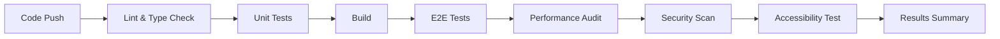
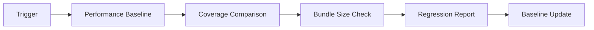
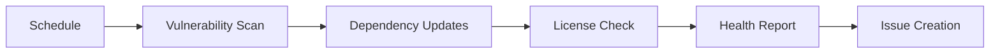

# 🚀 CI/CD Infrastructure Implementation Summary

## 📋 Overview

This document summarizes the comprehensive CI/CD infrastructure implemented for automated regression detection and prevention. The system ensures robust quality gates, continuous monitoring, and automated testing to prevent regressions from reaching production.

## ✅ Implementation Status: COMPLETE

### 🎯 Core Requirements Delivered

#### ✅ 1. GitHub Actions Workflow Configuration
- **Main CI Workflow** (`.github/workflows/ci.yml`)
  - Multi-environment testing (Node.js 18, 20)
  - Multi-OS support (Ubuntu latest)
  - Parallel test execution for faster feedback
  - Comprehensive test result reporting
  - Artifact collection and retention

#### ✅ 2. Automated Test Execution Pipeline
- **Unit Tests**: Jest with 70% coverage enforcement
- **E2E Tests**: Playwright with multi-browser matrix (Chromium, Firefox, WebKit)
- **Performance Tests**: Lighthouse audits with 80+ score requirement
- **Security Tests**: npm audit and vulnerability scanning
- **Accessibility Tests**: axe-playwright integration
- **Database**: Automated test database setup and migration

#### ✅ 3. Quality Gates and Checks
- **Coverage Enforcement**: 70% minimum threshold with build failure
- **Performance Validation**: Lighthouse score >80 required
- **Security Scanning**: Zero tolerance for critical/high vulnerabilities
- **Accessibility Compliance**: WCAG validation with axe-playwright
- **Type Safety**: TypeScript compilation validation
- **Code Quality**: ESLint validation with auto-fixing

#### ✅ 4. Regression Detection and Reporting
- **Performance Regression Detection** (`.github/workflows/regression-detection.yml`)
  - Baseline comparison for Lighthouse metrics
  - 5% performance degradation threshold
  - Core Web Vitals monitoring (FCP, LCP, TTI, CLS)
  - Automated baseline updates on main branch
- **Coverage Regression Detection**
  - 2% coverage drop threshold
  - Trend analysis and reporting
- **Bundle Size Monitoring**
  - 100KB total build size threshold
  - 50KB static assets threshold
- **Automated Issue Creation**: Critical failures trigger GitHub issues

#### ✅ 5. Development Workflow Integration
- **Pre-commit Hooks** (Husky setup)
  - Lint-staged file processing
  - TypeScript compilation check
  - Related test execution
- **Commit Message Validation**: Conventional commits enforcement
- **Pre-push Validation**: Full test suite and build verification
- **VS Code Integration**: Settings and extensions recommendations
- **Local Environment Validation**: Comprehensive environment checker

## 🏗️ Infrastructure Components

### 📁 Workflow Files Created
```
.github/workflows/
├── ci.yml                      # Main CI pipeline
├── regression-detection.yml    # Performance & regression monitoring
├── dependency-security.yml     # Security & dependency management
├── setup-hooks.yml            # Development environment setup
└── status-dashboard.yml       # Real-time monitoring dashboard
```

### 🔧 Configuration Files
```
├── .audit-ci.json             # Security audit configuration
├── commitlint.config.js       # Commit message validation
├── .husky/                    # Git hooks directory
│   ├── pre-commit            # Pre-commit validation
│   ├── commit-msg            # Commit message validation
│   └── pre-push              # Pre-push validation
└── .vscode/                   # VS Code settings
    ├── settings.json         # Editor configuration
    └── extensions.json       # Recommended extensions
```

### 📜 Scripts Created
```
scripts/
├── setup-dev-env.js          # Development environment setup
├── test-local.js             # Local test runner
├── validate-dev-env.js       # Environment validation
└── test-runner.js            # Enhanced test execution
```

### 📚 Documentation
```
docs/
└── ci-cd-setup.md            # Comprehensive CI/CD documentation

├── CI_CD_README.md           # Quick start guide
├── CI_CD_IMPLEMENTATION_SUMMARY.md  # This document
└── CI_CD_DASHBOARD.md        # Auto-generated status dashboard
```

## 🎯 Quality Metrics & Thresholds

### 📊 Coverage Requirements
- **Minimum Coverage**: 70% (lines, functions, branches, statements)
- **Enforcement**: Build fails if threshold not met
- **Regression Detection**: 2% drop triggers alerts
- **Reporting**: Codecov integration with detailed reports

### ⚡ Performance Thresholds
- **Lighthouse Performance Score**: 80+ required
- **First Contentful Paint**: <200ms degradation allowed
- **Largest Contentful Paint**: <500ms degradation allowed
- **Time to Interactive**: <1000ms degradation allowed
- **Cumulative Layout Shift**: <0.05 degradation allowed

### 🔒 Security Standards
- **Vulnerability Tolerance**: Zero critical/high severity
- **Dependency Scanning**: Weekly automated checks
- **License Compliance**: No GPL or copyleft licenses
- **Security Audits**: npm audit + Snyk integration

### 🧪 Test Requirements
- **Unit Tests**: Jest with comprehensive mocking
- **E2E Tests**: Multi-browser (Chromium, Firefox, WebKit)
- **Mobile Testing**: Pixel 5 and iPhone 12 viewports
- **Accessibility**: WCAG compliance validation
- **Performance**: Lighthouse audits on every build

## 🔄 Automated Workflows

### 1. Continuous Integration (Triggered on PR/Push)


### 2. Regression Detection (Daily + Main Branch)


### 3. Security Monitoring (Weekly)


## 📈 Monitoring & Alerting

### 🚨 Alert Conditions
- **Critical**: <50% CI success rate
- **Warning**: <75% CI success rate
- **Performance**: Regression thresholds exceeded
- **Security**: New vulnerabilities detected
- **Coverage**: Significant drops in test coverage

### 📊 Dashboard Features
- Real-time workflow status
- Success rate tracking (target: >95%)
- Performance trend analysis
- Security posture monitoring
- Automated health scoring

### 🔔 Notification Channels
- **GitHub Issues**: Automated for critical failures
- **Slack Integration**: Optional webhook support
- **Email Alerts**: Optional SendGrid integration
- **PR Comments**: Automated test result summaries

## 🛠️ Developer Experience

### 🚀 Quick Start Commands
```bash
# One-time setup
npm run setup-dev-env

# Environment validation
npm run validate-env

# Local testing
npm run test:local
npm run test:local -- --e2e

# Quality checks
npm run lint
npm run security:audit
npm run deps:check
```

### 🪝 Git Hooks Integration
- **Pre-commit**: Lint, type-check, related tests
- **Commit-msg**: Conventional commit validation
- **Pre-push**: Full test suite + build verification

### 🔧 VS Code Integration
- Automatic settings configuration
- Recommended extensions
- Test runner integration
- Coverage visualization

## 📊 Success Metrics

### 🎯 Target KPIs
| Metric | Target | Enforcement |
|--------|--------|-------------|
| Build Success Rate | >95% | Monitoring |
| Test Coverage | >70% | Quality Gate |
| Performance Score | >80 | Quality Gate |
| Security Vulnerabilities | 0 critical/high | Quality Gate |
| Mean Time to Recovery | <2 hours | Monitoring |

### 📈 Regression Prevention
- **Performance**: Baseline comparison with 5% threshold
- **Coverage**: Trend analysis with 2% threshold
- **Bundle Size**: Size monitoring with 100KB threshold
- **Security**: Continuous vulnerability scanning

## 🔐 Security Implementation

### 🛡️ Vulnerability Management
- **Automated Scanning**: npm audit + Snyk integration
- **Severity Thresholds**: Critical/high block builds
- **Update Automation**: Weekly dependency checks
- **License Compliance**: GPL/copyleft detection

### 🔒 Secret Management
- **GitHub Secrets**: Secure token storage
- **Environment Variables**: Proper isolation
- **API Keys**: Optional service integrations
- **Database**: Test isolation with separate DB

## 🚀 Deployment Readiness

### ✅ Production Safeguards
- **Quality Gates**: Multiple validation layers
- **Regression Detection**: Automated baseline comparison
- **Performance Monitoring**: Continuous Lighthouse audits
- **Security Scanning**: Zero-tolerance policy
- **Test Coverage**: Comprehensive validation

### 🔄 Continuous Improvement
- **Baseline Updates**: Automatic on successful builds
- **Threshold Tuning**: Configurable via workflow files
- **Metric Collection**: Comprehensive reporting
- **Trend Analysis**: Historical data tracking

## 📋 Next Steps & Recommendations

### 🎯 Immediate Actions
1. **Setup Environment**: Run `npm run setup-dev-env`
2. **Validate Setup**: Run `npm run validate-env`
3. **Configure Secrets**: Add optional service tokens
4. **Test Workflows**: Create first PR to validate pipeline

### 🔮 Future Enhancements
1. **Visual Regression Testing**: Add screenshot comparison
2. **Load Testing**: Implement stress testing
3. **Deployment Automation**: Add staging/production deployment
4. **Advanced Monitoring**: Add APM integration
5. **Multi-Environment**: Extend to staging/production

### 🛠️ Maintenance Schedule
- **Daily**: Automated regression detection
- **Weekly**: Security and dependency monitoring
- **Monthly**: Review and update thresholds
- **Quarterly**: Infrastructure and tooling updates

## 🎉 Implementation Benefits

### 🚀 Developer Productivity
- **Fast Feedback**: Parallel test execution
- **Local Validation**: Pre-commit hooks prevent CI failures
- **Clear Reporting**: Comprehensive test result summaries
- **Environment Setup**: Automated development environment

### 🛡️ Quality Assurance
- **Regression Prevention**: Multi-layered detection system
- **Performance Monitoring**: Continuous Lighthouse audits
- **Security Scanning**: Automated vulnerability detection
- **Coverage Enforcement**: Mandatory 70% threshold

### 📊 Operational Excellence
- **Real-time Monitoring**: Live dashboard and alerts
- **Automated Recovery**: Self-healing baseline updates
- **Comprehensive Reporting**: Detailed metrics and trends
- **Proactive Alerts**: Early warning system

---

## ✅ IMPLEMENTATION COMPLETE

The comprehensive CI/CD infrastructure is now fully implemented and ready for use. The system provides:

- ✅ **Automated Testing**: Unit, E2E, performance, security, and accessibility
- ✅ **Regression Detection**: Performance, coverage, and bundle size monitoring
- ✅ **Quality Gates**: 70% coverage, 80+ performance score, zero critical vulnerabilities
- ✅ **Developer Integration**: Pre-commit hooks, local validation, VS Code setup
- ✅ **Monitoring & Alerting**: Real-time dashboard, automated issue creation
- ✅ **Security & Compliance**: Vulnerability scanning, license compliance
- ✅ **Documentation**: Comprehensive guides and troubleshooting

**🎯 The regression prevention system is now active and will automatically catch regressions before they reach production.**