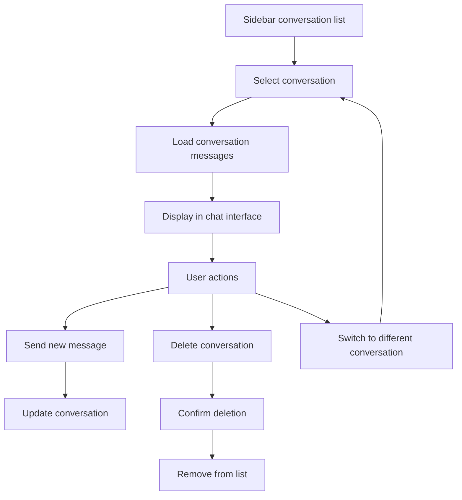
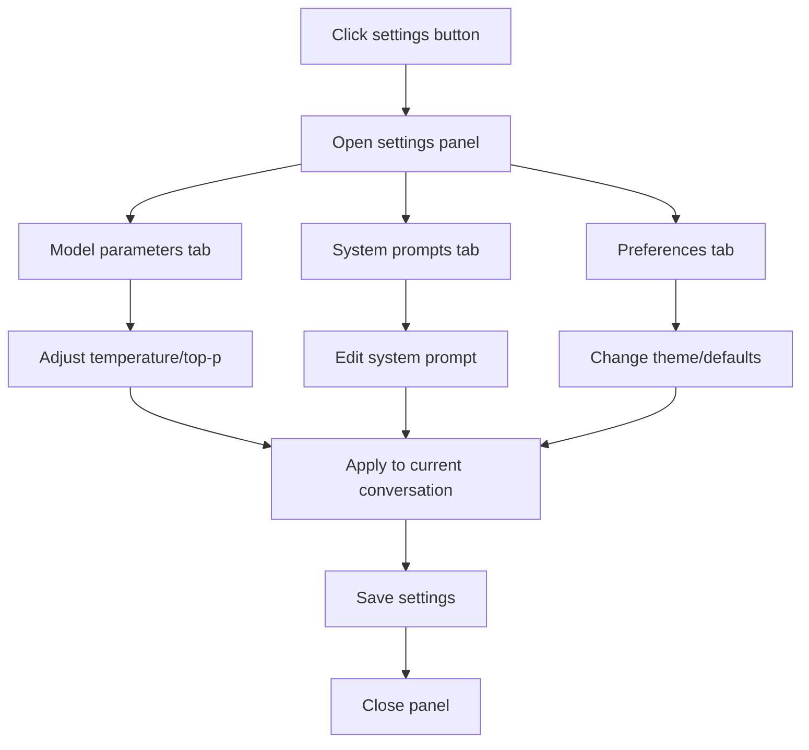

# Ollama Web Chat - Design Specification

## Executive Summary

The Ollama Web Chat application is a modern, desktop-first AI chat interface designed for power users, developers, and AI enthusiasts. Built with Next.js 15, React 19, and TypeScript, it provides a sophisticated web interface for conversational AI interactions with Ollama models. The application emphasizes real-time streaming, persistent conversation management, and a clean, professional user experience optimized for productivity.

### Design Goals
- **Desktop-First Experience**: Optimized for 1200px+ screens with responsive adaptations
- **Power User Focus**: Advanced features, keyboard shortcuts, and productivity enhancements
- **Real-time Interaction**: Seamless streaming chat with immediate visual feedback
- **Professional Aesthetics**: Clean, modern interface with excellent typography and spacing
- **Accessibility**: WCAG 2.1 AA compliance with full keyboard navigation support

---

## Design System Foundation

### Color Palette

#### Light Theme
- **Background Primary**: `#FFFFFF` (Pure white for main content areas)
- **Background Secondary**: `#F9FAFB` (Light gray for page background)
- **Background Tertiary**: `#F3F4F6` (Sidebar and secondary areas)
- **Border Primary**: `#E5E7EB` (Main borders and dividers)
- **Border Secondary**: `#D1D5DB` (Secondary borders)
- **Text Primary**: `#111827` (Main text content)
- **Text Secondary**: `#6B7280` (Secondary text, metadata)
- **Text Tertiary**: `#9CA3AF` (Placeholder text, disabled states)

#### Dark Theme
- **Background Primary**: `#111827` (Main content background)
- **Background Secondary**: `#1F2937` (Page background)
- **Background Tertiary**: `#374151` (Sidebar and secondary areas)
- **Border Primary**: `#374151` (Main borders)
- **Border Secondary**: `#4B5563` (Secondary borders)
- **Text Primary**: `#F9FAFB` (Main text)
- **Text Secondary**: `#D1D5DB` (Secondary text)
- **Text Tertiary**: `#9CA3AF` (Placeholder text)

#### Accent Colors
- **Primary Blue**: `#3B82F6` (User messages, primary actions)
- **Primary Blue Hover**: `#2563EB`
- **Success Green**: `#10B981` (Success states, confirmations)
- **Warning Yellow**: `#F59E0B` (Warnings, cautions)
- **Error Red**: `#EF4444` (Errors, destructive actions)
- **Assistant Gray**: `#6B7280` (Assistant message backgrounds)

### Typography

#### Font Stack
- **Primary**: `Inter, -apple-system, BlinkMacSystemFont, "Segoe UI", Roboto, sans-serif`
- **Monospace**: `"JetBrains Mono", "Fira Code", Consolas, monospace`

#### Type Scale
- **Display Large**: 32px / 40px (Page titles, major headings)
- **Display Medium**: 24px / 32px (Section headings)
- **Heading Large**: 20px / 28px (Component headings)
- **Heading Medium**: 18px / 24px (Subsection headings)
- **Body Large**: 16px / 24px (Primary body text)
- **Body Medium**: 14px / 20px (Secondary body text, UI labels)
- **Body Small**: 12px / 16px (Metadata, timestamps, captions)
- **Code**: 14px / 20px (Code blocks, technical content)

#### Font Weights
- **Regular**: 400 (Body text, secondary content)
- **Medium**: 500 (UI labels, emphasized text)
- **Semibold**: 600 (Headings, important labels)
- **Bold**: 700 (Major headings, critical information)

### Spacing System

#### Base Unit: 4px
- **xs**: 4px (Tight spacing, icon gaps)
- **sm**: 8px (Small component spacing)
- **md**: 12px (Medium component spacing)
- **lg**: 16px (Large component spacing)
- **xl**: 20px (Section spacing)
- **2xl**: 24px (Major section spacing)
- **3xl**: 32px (Page-level spacing)
- **4xl**: 48px (Major layout spacing)

### Component Specifications

#### Buttons
- **Height**: 44px (Primary), 36px (Secondary), 28px (Small)
- **Padding**: 16px horizontal, 12px vertical
- **Border Radius**: 8px
- **Font Weight**: 500 (Medium)
- **Transition**: 150ms ease-in-out

#### Input Fields
- **Height**: 44px (Single line), Auto (Textarea)
- **Padding**: 12px horizontal, 10px vertical
- **Border**: 1px solid border color
- **Border Radius**: 8px
- **Focus Ring**: 2px blue outline with 2px offset

#### Cards & Containers
- **Border Radius**: 12px (Large cards), 8px (Small cards)
- **Shadow**: `0 1px 3px rgba(0, 0, 0, 0.1)` (Light), `0 4px 6px rgba(0, 0, 0, 0.1)` (Elevated)
- **Padding**: 16px (Standard), 24px (Large)

---

## Page-by-Page Breakdown

### 1. Authentication Page (`/auth/signin`)

#### Purpose & Context
Single-page authentication interface for guest login access. Serves as the entry point for unauthenticated users with a clean, focused design that emphasizes the demo nature of the application.

#### Layout Structure
- **Container**: Centered layout, max-width 400px
- **Vertical Spacing**: 32px between major sections
- **Background**: Full-screen gradient or solid color
- **Card**: Elevated white card with 24px padding

#### Content Requirements
- **Page Title**: "Sign In to Ollama Chat"
- **Subtitle**: "Demo access with guest credentials"
- **Form Fields**:
  - Email input (pre-filled: `guest@example.com`)
  - Password input (pre-filled: `guest`)
  - Sign In button (primary, full-width)
- **Helper Text**: "Use the pre-filled credentials to access the demo"
- **Footer**: Optional branding or version information

#### Interactive Elements
- **Email Field**: 
  - Type: email
  - Placeholder: "Enter your email"
  - Validation: Required, email format
- **Password Field**:
  - Type: password
  - Placeholder: "Enter your password"
  - Validation: Required, minimum 4 characters
- **Sign In Button**:
  - State: Default, Loading, Success, Error
  - Loading: Spinner with "Signing in..." text
  - Keyboard: Enter key submits form

#### States
- **Default**: Clean form with pre-filled values
- **Loading**: Button shows spinner, fields disabled
- **Error**: Red border on fields, error message below form
- **Success**: Brief success state before redirect

#### Responsive Behavior
- **Desktop (1200px+)**: Centered card with background
- **Tablet (768px-1199px)**: Slightly smaller card, maintained centering
- **Mobile (320px-767px)**: Full-width card with reduced padding

#### Accessibility Requirements
- **Focus Management**: Logical tab order, visible focus indicators
- **Screen Reader**: Proper labels, error announcements
- **Keyboard Navigation**: Full functionality without mouse
- **Color Contrast**: Minimum 4.5:1 ratio for all text

### 2. Main Chat Interface (`/`)

#### Purpose & Context
The primary application interface where users interact with AI models through real-time chat. This is the core experience, optimized for extended use sessions with multiple conversations.

#### Layout Structure
- **Grid**: Three-column layout (Sidebar | Chat | Settings Panel)
- **Sidebar**: 320px fixed width, collapsible to 0px
- **Chat Area**: Flexible width, 800px max-width for readability
- **Header**: 60px fixed height across full width
- **Footer Input**: 80px minimum height, auto-expanding

#### Content Requirements
- **Header**: App title, model indicator, user controls
- **Sidebar**: Conversation list, new conversation button
- **Chat Area**: Message history, streaming indicator, input field
- **Empty State**: Welcome message with getting started guidance

#### Interactive Elements
- **Message Input**:
  - Multi-line textarea with auto-resize
  - Send button (icon + text)
  - File upload button (future enhancement)
  - Keyboard shortcuts (Enter to send, Shift+Enter for new line)
- **Message Actions**:
  - Copy message content
  - Regenerate response (assistant messages)
  - Edit message (user messages)
  - Message reactions (future enhancement)

#### States
- **Loading**: Skeleton screens for initial load
- **Empty**: Welcome state with call-to-action
- **Active Chat**: Normal conversation state
- **Streaming**: Real-time message generation
- **Error**: Connection or model errors
- **Offline**: No connection to Ollama server

#### Responsive Behavior
- **Desktop (1200px+)**: Full three-column layout
- **Laptop (1024px-1199px)**: Sidebar overlay on demand
- **Tablet (768px-1023px)**: Sidebar drawer, optimized touch targets
- **Mobile (320px-767px)**: Single column, bottom navigation

---

## Component Library

### 1. Message Bubble Component

#### Purpose
Displays individual chat messages with role-based styling and metadata.

#### Variants
- **User Message**: Right-aligned, blue background, white text
- **Assistant Message**: Left-aligned, gray background, dark text
- **System Message**: Centered, minimal styling, italic text
- **Streaming Message**: Assistant variant with typing indicator

#### Structure
```
MessageBubble
├── Avatar (User icon or Bot icon)
├── Content Container
│   ├── Message Text (markdown support)
│   ├── Attachments (future: files, images)
│   └── Metadata (timestamp, model info)
└── Actions Menu (copy, edit, regenerate)
```

#### Specifications
- **Max Width**: 80% of container
- **Padding**: 16px horizontal, 12px vertical
- **Border Radius**: 16px (speech bubble style)
- **Avatar Size**: 32px diameter
- **Spacing**: 16px between messages, 8px between avatar and content

#### States
- **Default**: Standard message display
- **Streaming**: Animated typing indicator
- **Selected**: Highlighted border for actions
- **Error**: Red border, error icon
- **Loading**: Skeleton placeholder

### 2. Conversation List Item

#### Purpose
Displays conversation metadata in the sidebar with selection and management controls.

#### Structure
```
ConversationItem
├── Icon (MessageSquare)
├── Content
│   ├── Title (truncated)
│   ├── Metadata (date, model, message count)
│   └── Preview (last message excerpt)
└── Actions
    ├── Delete Button (hover reveal)
    └── More Menu (future: rename, export)
```

#### Specifications
- **Height**: 72px fixed
- **Padding**: 12px horizontal, 8px vertical
- **Border Radius**: 8px
- **Icon Size**: 16px
- **Title**: 14px semibold, single line with ellipsis
- **Metadata**: 12px regular, gray text

#### States
- **Default**: Subtle hover effect
- **Selected**: Blue background, white text
- **Hover**: Gray background, reveal actions
- **Loading**: Skeleton animation
- **Deleting**: Fade out animation

### 3. Header Component

#### Purpose
Primary navigation and application controls across the top of the interface.

#### Structure
```
Header
├── Left Section
│   ├── Sidebar Toggle
│   ├── App Title
│   └── Model Indicator
├── Center Section (future: search)
└── Right Section
    ├── Settings Button
    ├── User Menu
    └── Sign Out
```

#### Specifications
- **Height**: 60px fixed
- **Padding**: 16px horizontal
- **Background**: White (light) / Dark gray (dark)
- **Border**: Bottom border, 1px gray
- **Title**: 18px semibold
- **Model Indicator**: 14px regular, gray text

#### States
- **Default**: Clean navigation bar
- **Settings Open**: Settings button highlighted
- **User Menu Open**: User menu highlighted
- **Mobile**: Condensed layout, hamburger menu

### 4. Input Area Component

#### Purpose
Message composition area with text input, formatting options, and send controls.

#### Structure
```
InputArea
├── Textarea Container
│   ├── Textarea (auto-resize)
│   ├── Placeholder Text
│   └── Character Counter (future)
├── Toolbar (future)
│   ├── File Upload
│   ├── Formatting Options
│   └── Templates Menu
└── Actions
    ├── Send Button
    └── Cancel Button (when streaming)
```

#### Specifications
- **Min Height**: 44px (single line)
- **Max Height**: 120px (scrollable beyond)
- **Padding**: 12px horizontal, 10px vertical
- **Border**: 1px gray, 2px blue on focus
- **Border Radius**: 8px
- **Send Button**: 44px square, blue background

#### States
- **Empty**: Placeholder text visible
- **Typing**: Character count, auto-resize
- **Ready**: Send button enabled
- **Sending**: Send button shows spinner
- **Disabled**: Grayed out during streaming

### 5. Sidebar Component

#### Purpose
Navigation panel for conversation management and application controls.

#### Structure
```
Sidebar
├── Header
│   ├── New Conversation Button
│   └── Search Bar (future)
├── Conversation List
│   ├── Today Section
│   ├── Yesterday Section
│   ├── This Week Section
│   └── Older Section
└── Footer
    ├── Settings Link
    └── User Profile
```

#### Specifications
- **Width**: 320px (expanded), 0px (collapsed)
- **Background**: Light gray (light) / Dark gray (dark)
- **Border**: Right border, 1px gray
- **Transition**: 300ms ease-in-out collapse animation
- **Scroll**: Smooth scrolling with momentum

#### States
- **Expanded**: Full width with content
- **Collapsed**: Hidden with smooth animation
- **Loading**: Skeleton conversation items
- **Empty**: Empty state with call-to-action
- **Search Active**: Filtered conversation list

---

## User Flow Diagrams

### Primary User Journey: New Conversation

```mermaid
flowchart TD
    A[User opens app] --> B{Authenticated?}
    B -->|No| C[Redirect to /auth/signin]
    B -->|Yes| D[Load main interface]
    C --> E[Guest login]
    E --> D
    D --> F[View conversation list]
    F --> G[Click "New Conversation"]
    G --> H[Create conversation with selected model]
    H --> I[Open empty chat interface]
    I --> J[Type first message]
    J --> K[Send message]
    K --> L[Stream AI response]
    L --> M[Continue conversation]
```

### Conversation Management Flow



### Settings & Configuration Flow



---

## Responsive Design Guidelines

### Breakpoint Strategy

#### Desktop First Approach
- **Primary Target**: 1200px+ (Desktop)
- **Secondary Target**: 1024px-1199px (Laptop)
- **Tablet Adaptation**: 768px-1023px
- **Mobile Adaptation**: 320px-767px

### Layout Adaptations

#### Desktop (1200px+)
- **Sidebar**: 320px fixed, always visible
- **Chat Area**: Flexible width, 800px max-width
- **Header**: Full navigation with all controls
- **Message Bubbles**: 80% max-width for readability
- **Typography**: Full scale, optimal line heights

#### Laptop (1024px-1199px)
- **Sidebar**: 280px fixed, collapsible
- **Chat Area**: Flexible width, 700px max-width
- **Header**: Condensed spacing, same functionality
- **Message Bubbles**: 85% max-width
- **Typography**: Slightly reduced scale

#### Tablet (768px-1023px)
- **Sidebar**: Overlay drawer, 320px width
- **Chat Area**: Full width when sidebar closed
- **Header**: Touch-optimized buttons (44px minimum)
- **Message Bubbles**: 90% max-width
- **Input Area**: Larger touch targets
- **Typography**: Maintained readability

#### Mobile (320px-767px)
- **Sidebar**: Full-screen overlay
- **Chat Area**: Full width, single column
- **Header**: Minimal controls, hamburger menu
- **Message Bubbles**: 95% max-width
- **Input Area**: Bottom-fixed, expanded touch area
- **Typography**: Optimized for small screens

### Touch Adaptations

#### Minimum Touch Targets
- **Buttons**: 44px × 44px minimum
- **List Items**: 48px minimum height
- **Input Fields**: 44px minimum height
- **Icon Buttons**: 40px × 40px minimum

#### Gesture Support
- **Swipe**: Left/right to open/close sidebar
- **Pull to Refresh**: Reload conversation list
- **Long Press**: Context menus for messages
- **Pinch to Zoom**: Text scaling support

---

## Interaction Specifications

### Animation & Transitions

#### Micro-interactions
- **Button Hover**: 150ms ease-in-out scale(1.02)
- **Button Press**: 100ms ease-out scale(0.98)
- **Focus Ring**: 200ms ease-in-out opacity
- **Loading Spinner**: 1s linear infinite rotation

#### Layout Transitions
- **Sidebar Toggle**: 300ms ease-in-out width transition
- **Message Appearance**: 200ms ease-out slide-up + fade-in
- **Streaming Text**: Character-by-character with 50ms delay
- **Page Transitions**: 250ms ease-in-out opacity

#### State Changes
- **Error States**: 300ms ease-in-out red border + shake
- **Success States**: 200ms ease-out green flash
- **Loading States**: Skeleton fade-in over 150ms
- **Empty States**: 400ms ease-out fade-in with slight scale

### Keyboard Shortcuts

#### Global Shortcuts
- **Ctrl/Cmd + N**: New conversation
- **Ctrl/Cmd + K**: Search conversations
- **Ctrl/Cmd + ,**: Open settings
- **Ctrl/Cmd + /**: Show keyboard shortcuts
- **Escape**: Close modals/panels

#### Chat Interface
- **Enter**: Send message
- **Shift + Enter**: New line in message
- **Ctrl/Cmd + Enter**: Force send (even when streaming)
- **Up Arrow**: Edit last message
- **Ctrl/Cmd + R**: Regenerate last response

#### Navigation
- **Tab**: Navigate through interactive elements
- **Shift + Tab**: Reverse navigation
- **Space**: Activate buttons/links
- **Arrow Keys**: Navigate lists

### Loading States

#### Progressive Loading
1. **Skeleton Screens**: Immediate layout with placeholder content
2. **Content Hydration**: Replace skeletons with real content
3. **Interactive Enhancement**: Enable interactions after full load

#### Streaming Indicators
- **Typing Indicator**: Animated dots for AI response generation
- **Progress Bar**: For file uploads and exports
- **Pulse Animation**: For real-time updates
- **Character Counter**: For message composition

### Error Handling

#### Error Types & Responses
- **Network Error**: Retry button with exponential backoff
- **Authentication Error**: Redirect to sign-in with message
- **Model Error**: Model selection prompt with alternatives
- **Rate Limit**: Cooldown timer with retry countdown

#### Error Message Patterns
- **Inline Errors**: Field-level validation with red borders
- **Toast Notifications**: Non-blocking temporary messages
- **Modal Dialogs**: Critical errors requiring user action
- **Banner Alerts**: Persistent system-wide issues

---

## Future Enhancement Roadmap

### Phase 1: Core Enhancements (Months 1-2)
- **Settings Panel**: Complete model parameter controls
- **File Upload**: Document and image attachment support
- **Export Features**: PDF, Markdown, and JSON export options
- **Search Functionality**: Global conversation and message search
- **Keyboard Shortcuts**: Full shortcut system implementation

### Phase 2: Advanced Features (Months 3-4)
- **Message Management**: Edit, regenerate, and branch conversations
- **Template System**: Pre-defined prompts and response templates
- **Model Management**: Install, update, and configure models
- **Performance Optimization**: Virtual scrolling and caching
- **Accessibility Audit**: WCAG 2.1 AA compliance verification

### Phase 3: Power User Features (Months 5-6)
- **Bulk Operations**: Multi-select conversation management
- **Advanced Search**: Filters, operators, and saved searches
- **Customization**: Themes, layouts, and personalization
- **Integration APIs**: External service connections
- **Collaboration**: Shared conversations and team features

### Phase 4: Enterprise & Scale (Months 7-12)
- **Multi-user Support**: User management and permissions
- **Organization Features**: Workspaces and team controls
- **Analytics Dashboard**: Usage metrics and insights
- **Plugin System**: Third-party extensions and integrations
- **Enterprise Security**: SSO, audit logs, compliance tools

### Design Considerations for Future Features

#### Extensibility Points
- **Component Architecture**: Modular design for easy feature addition
- **Theme System**: CSS custom properties for easy customization
- **API Design**: RESTful endpoints with consistent patterns
- **State Management**: Scalable store architecture for complex features

#### Performance Considerations
- **Code Splitting**: Lazy load advanced features
- **Caching Strategy**: Intelligent data caching and invalidation
- **Bundle Optimization**: Tree shaking and dead code elimination
- **Image Optimization**: WebP support and responsive images

#### Accessibility Future-Proofing
- **Screen Reader Support**: Comprehensive ARIA implementation
- **Keyboard Navigation**: Full interface accessibility
- **Color Contrast**: High contrast mode support
- **Font Scaling**: Responsive to user preferences

---

## Technical Implementation Notes

### CSS Architecture
- **Utility-First**: Tailwind CSS for rapid development
- **Component Styles**: CSS modules for complex components
- **Custom Properties**: CSS variables for theming
- **Responsive Design**: Mobile-first media queries

### State Management
- **Global State**: Zustand for conversation and UI state
- **Server State**: React Query for API data management
- **Local State**: React hooks for component-specific state
- **Persistent State**: localStorage for user preferences

### Performance Optimization
- **Code Splitting**: Route-based and component-based splitting
- **Image Optimization**: Next.js Image component with WebP
- **Bundle Analysis**: Regular bundle size monitoring
- **Caching**: Aggressive caching for static assets

### Browser Support
- **Modern Browsers**: Chrome 90+, Firefox 88+, Safari 14+, Edge 90+
- **Progressive Enhancement**: Core functionality without JavaScript
- **Polyfills**: Minimal polyfills for essential features
- **Graceful Degradation**: Fallbacks for unsupported features

---

This design specification provides a comprehensive foundation for creating detailed mockups and prototypes of the Ollama Web Chat application. The document balances current functionality with future enhancements, ensuring a scalable and maintainable design system that can evolve with user needs and technological advances.