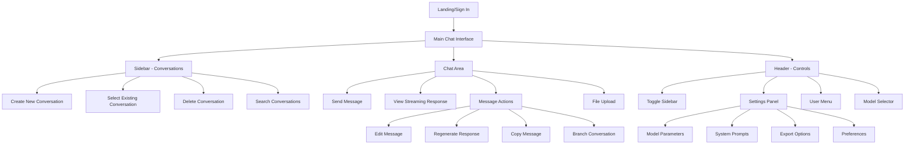
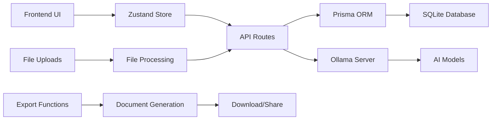

# Ollama Web Chat - Design Specification Plan

## Overview
This document outlines the comprehensive plan for creating a design specification for the Ollama Web Chat application. The analysis is based on a thorough examination of the Next.js codebase and focuses on desktop-first design for power users, including both current functionality and advanced capabilities.

## 1. Application Architecture Overview

### Application Type
- **Primary Function**: AI-powered chat interface for Ollama models
- **Target Users**: Power users, developers, and AI enthusiasts
- **Core Purpose**: Modern web interface for conversational AI interactions
- **Technology Stack**: Next.js 15, React 19, TypeScript, Prisma, SQLite, NextAuth, Zustand

### Key Characteristics
- Real-time streaming chat interface
- Persistent conversation management
- Multi-model AI integration
- Guest authentication system
- Responsive design with dark/light themes

## 2. Current Feature Analysis

### Core Implemented Features

#### Authentication System
- NextAuth.js integration with credentials provider
- Guest login functionality (`guest@example.com` / `guest`)
- JWT session management
- Automatic redirect to signin for unauthenticated users

#### Conversation Management
- Create new conversations with selected model
- View conversation list in sidebar
- Delete conversations with confirmation
- Persistent storage in SQLite database
- Conversation metadata (title, model, timestamps, message count)

#### Real-time Chat Interface
- Streaming responses from Ollama models
- Message bubbles with user/assistant distinction
- Auto-scrolling to latest messages
- Typing indicators during streaming
- Message timestamps with relative time formatting

#### Model Integration
- Dynamic model selection from Ollama server
- Temperature control for response generation
- System prompt configuration
- Real-time model switching
- Connection status monitoring

#### UI Components
- Collapsible sidebar (320px width)
- Responsive header with navigation controls
- Chat interface with message history
- Loading states and error handling
- Dark/light theme support

### Database Schema
- **Users**: Authentication and profile data
- **Conversations**: Chat sessions with metadata
- **Messages**: Individual chat messages with roles
- **UserSettings**: Preferences and configuration

## 3. Enhanced Features for Design Specification

### Advanced Capabilities to Include

#### Settings Panel
- Model parameter controls (temperature, top-p, top-k)
- System prompt editor with templates
- Default model selection
- Ollama server URL configuration
- UI preferences and customization

#### File Upload Interface
- Document upload for context (PDF, TXT, MD)
- Image upload for vision models
- Drag-and-drop functionality
- File preview and management
- Attachment indicators in messages

#### Conversation Export
- Export to PDF with formatting
- Markdown export for documentation
- JSON export for data portability
- Batch export capabilities
- Custom export templates

#### User Preferences
- Theme selection (light/dark/auto)
- Default model preferences
- Message display options
- Keyboard shortcut customization
- Notification settings

#### Search & Filter
- Global conversation search
- Message content search
- Filter by model, date, or tags
- Advanced search operators
- Search result highlighting

#### Model Management
- Install new models from Ollama
- Update existing models
- Model information and capabilities
- Performance metrics display
- Custom model configurations

#### Advanced Chat Features
- Message editing and regeneration
- Conversation branching
- Message copying and sharing
- Quick response templates
- Message reactions and annotations

## 4. User Flow Mapping



## 5. Page Structure & Navigation

### Primary Routes
- `/auth/signin` - Authentication page with guest login
- `/` - Main chat interface (protected route)
- Settings accessed via modal/panel overlay

### Component Hierarchy
```
RootLayout (SessionProvider)
├── SignIn Page
└── Main Interface
    ├── Header
    │   ├── Sidebar Toggle
    │   ├── App Title & Model Display
    │   ├── Settings Button
    │   └── User Menu
    ├── Sidebar (Collapsible)
    │   ├── New Conversation Button
    │   ├── Search Bar
    │   └── Conversation List
    └── Chat Area
        ├── Message History
        ├── Streaming Indicator
        └── Input Area
            ├── Text Input
            ├── File Upload
            └── Send Button
```

### Modal/Overlay Components
- Settings Panel
- Export Dialog
- Model Management
- File Preview
- Confirmation Dialogs

## 6. Data Flow Architecture



### State Management
- **Global State**: Zustand store for conversations, models, UI state
- **Local State**: Component-specific state for forms and interactions
- **Server State**: API responses cached and synchronized
- **Persistent State**: User preferences and settings

## 7. Design System Requirements

### Desktop-First Approach
- **Optimal Width**: 1200px+ for primary experience
- **Minimum Width**: 768px with responsive adjustments
- **Sidebar**: 320px fixed width, collapsible to icon-only
- **Chat Area**: Flexible width with 800px max-width for readability
- **Header**: 60px height with consistent navigation

### Typography Hierarchy
- **Primary**: Inter font family for readability
- **Headings**: Clear size progression (24px, 20px, 18px, 16px)
- **Body Text**: 14px for messages, 12px for metadata
- **Code**: Monospace font for technical content
- **Line Height**: 1.5 for optimal reading experience

### Color System
- **Light Theme**: Clean whites and grays with blue accents
- **Dark Theme**: Dark grays with high contrast text
- **Accent Colors**: Blue for primary actions, red for destructive actions
- **Status Colors**: Green for success, yellow for warnings, red for errors
- **Message Colors**: Distinct colors for user vs assistant messages

## 8. Key UI States

### Loading States
- **Initial Load**: Skeleton screens for conversations
- **Message Sending**: Loading indicator on send button
- **Streaming**: Animated typing indicator
- **Model Switching**: Loading overlay with progress

### Error States
- **Connection Error**: Ollama server unavailable
- **Authentication Error**: Session expired
- **Model Error**: Selected model not available
- **Upload Error**: File processing failed

### Empty States
- **No Conversations**: Welcome message with call-to-action
- **No Models**: Setup instructions for Ollama
- **No Search Results**: Helpful suggestions
- **No Messages**: Conversation starter prompts

### Interactive States
- **Hover Effects**: Subtle feedback on interactive elements
- **Focus States**: Clear keyboard navigation indicators
- **Active States**: Visual feedback for current selections
- **Disabled States**: Clear indication of unavailable actions

## 9. Advanced Interaction Patterns

### Chat Enhancements
- **Message Threading**: Visual indicators for conversation branches
- **Rich Content**: Syntax highlighting for code, markdown rendering
- **File Attachments**: Inline preview with download options
- **Quick Actions**: Context menus for message operations
- **Templates**: Pre-defined prompts and responses

### Productivity Features
- **Keyboard Shortcuts**: 
  - `Ctrl+N`: New conversation
  - `Ctrl+K`: Search conversations
  - `Ctrl+/`: Show shortcuts
  - `Escape`: Close modals
- **Bulk Operations**: Multi-select for conversation management
- **Search Interface**: Global search with filters and operators
- **Export Workflows**: Batch export with customization options

### Accessibility Features
- **Keyboard Navigation**: Full interface accessible via keyboard
- **Screen Reader Support**: Proper ARIA labels and descriptions
- **High Contrast**: Alternative color schemes for visibility
- **Font Scaling**: Responsive to user font size preferences

## 10. Technical Considerations for Design

### Performance Optimizations
- **Virtual Scrolling**: For conversations with many messages
- **Lazy Loading**: Load conversation history on demand
- **Caching Strategy**: Cache model responses and conversation metadata
- **Image Optimization**: Compress and resize uploaded images

### Responsive Behavior
- **Breakpoints**: 768px, 1024px, 1200px, 1440px
- **Mobile Adaptations**: Collapsible sidebar, touch-friendly controls
- **Tablet Experience**: Optimized for touch and stylus input
- **Desktop Enhancements**: Hover states, keyboard shortcuts

### Browser Compatibility
- **Modern Browsers**: Chrome 90+, Firefox 88+, Safari 14+, Edge 90+
- **Progressive Enhancement**: Core functionality without JavaScript
- **Fallback Strategies**: Graceful degradation for older browsers

## 11. Future-Proofing Elements

### Extensibility Points
- **Plugin System**: Third-party integrations and extensions
- **Custom Models**: User-defined model configurations
- **API Integration**: External service connections (GitHub, Notion, etc.)
- **Theming System**: Custom themes and branding options

### Scalability Considerations
- **Multi-user Support**: Team collaboration features
- **Organization Management**: Workspace and team controls
- **Advanced Analytics**: Usage metrics and insights
- **Enterprise Features**: SSO, audit logs, compliance tools

### Integration Opportunities
- **Version Control**: Git integration for conversation history
- **Documentation**: Export to documentation platforms
- **Collaboration**: Real-time collaboration on conversations
- **Automation**: Workflow triggers and integrations

## Implementation Phases

### Phase 1: Current Feature Enhancement
- Improve existing UI components
- Add missing interactive states
- Enhance accessibility
- Optimize performance

### Phase 2: Advanced Features
- Settings panel implementation
- File upload capabilities
- Export functionality
- Search and filtering

### Phase 3: Power User Features
- Keyboard shortcuts
- Bulk operations
- Advanced model management
- Customization options

### Phase 4: Future Enhancements
- Multi-user support
- Plugin system
- Advanced integrations
- Enterprise features

This plan provides the foundation for creating a comprehensive design specification that covers both current functionality and future enhancements, with a focus on desktop-first design for power users.