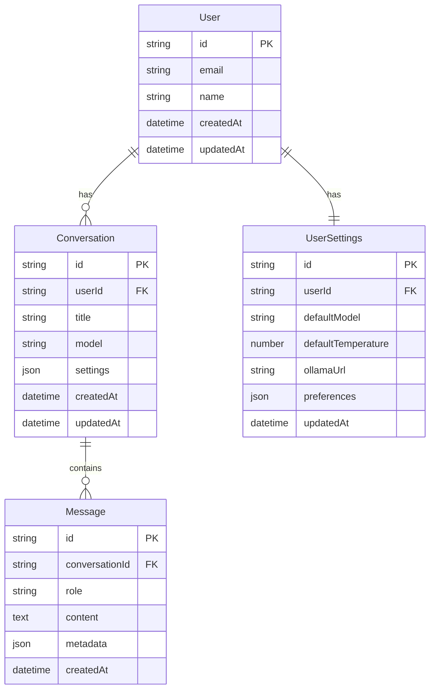

# 🏗️ Ollama Web App Architecture Plan

## Project Overview
Transform the existing TypeScript CLI client into a modern Next.js web application with user sessions, persistent chat history, model management, and advanced settings while preserving all existing functionality.

## Technology Stack
- **Frontend**: Next.js 14+ with TypeScript, React, Tailwind CSS
- **Backend**: Next.js API routes
- **Database**: SQLite with Prisma ORM for development, easily upgradeable to PostgreSQL
- **Authentication**: NextAuth.js for user sessions
- **Real-time**: Server-Sent Events (SSE) for streaming responses
- **State Management**: Zustand for client-side state
- **UI Components**: Radix UI + Tailwind for modern, accessible components

## Architecture Diagram

```mermaid
graph TB
    subgraph "Client Browser"
        A[React Frontend] --> B[Chat Interface]
        A --> C[Settings Panel]
        A --> D[Model Selector]
        A --> E[History Sidebar]
    end
    
    subgraph "Next.js Application"
        F[API Routes] --> G[/api/chat - Streaming]
        F --> H[/api/models - List Models]
        F --> I[/api/history - Chat History]
        F --> J[/api/auth - Authentication]
        
        K[Middleware] --> L[Auth Check]
        K --> M[CORS Handling]
    end
    
    subgraph "Data Layer"
        N[SQLite Database] --> O[Users Table]
        N --> P[Conversations Table]
        N --> Q[Messages Table]
        N --> R[Settings Table]
    end
    
    subgraph "External Services"
        S[Ollama Server]
        T[NextAuth Providers]
    end
    
    A --> F
    G --> S
    J --> T
    F --> N
    
    style A fill:#e1f5fe
    style F fill:#f3e5f5
    style N fill:#e8f5e8
    style S fill:#fff3e0
```

## Database Schema



## Feature Implementation Plan

### Phase 1: Core Infrastructure
1. **Project Setup**
   - Initialize Next.js project with TypeScript
   - Configure Tailwind CSS and Radix UI
   - Set up Prisma with SQLite
   - Configure NextAuth.js

2. **Database & Authentication**
   - Create database schema
   - Implement user authentication
   - Set up session management

### Phase 2: Core Chat Functionality
1. **Ollama Integration**
   - Port existing `OllamaClient` class to work with Next.js API routes
   - Implement streaming chat API endpoint
   - Create model listing endpoint

2. **Basic Chat Interface**
   - Build responsive chat UI with message bubbles
   - Implement real-time streaming responses
   - Add typing indicators and loading states

### Phase 3: Advanced Features
1. **Chat Management**
   - Conversation creation and persistence
   - Chat history sidebar with search
   - Message editing and regeneration

2. **Model & Settings Management**
   - Dynamic model switching
   - Advanced settings panel (temperature, system prompts, etc.)
   - User preferences persistence

### Phase 4: Enhanced UX
1. **Advanced UI Features**
   - Dark/light theme toggle
   - Keyboard shortcuts
   - Export conversations
   - Message reactions and bookmarking

2. **Performance & Polish**
   - Optimize streaming performance
   - Add error handling and retry logic
   - Implement caching strategies

## File Structure
```
ollama-web-app/
├── src/
│   ├── app/
│   │   ├── api/
│   │   │   ├── auth/
│   │   │   ├── chat/
│   │   │   ├── models/
│   │   │   └── history/
│   │   ├── chat/
│   │   ├── settings/
│   │   └── layout.tsx
│   ├── components/
│   │   ├── chat/
│   │   ├── ui/
│   │   └── layout/
│   ├── lib/
│   │   ├── ollama-client.ts
│   │   ├── db.ts
│   │   └── auth.ts
│   ├── types/
│   └── stores/
├── prisma/
├── public/
└── package.json
```

## Key Components to Build

### Chat Interface Components
- **ChatContainer** - Main chat layout
- **MessageBubble** - Individual message display
- **StreamingMessage** - Real-time message streaming
- **ChatInput** - Message input with file upload

### Navigation & Layout
- **Sidebar** - Chat history and navigation
- **Header** - User menu and settings
- **ModelSelector** - Dynamic model switching

### Settings & Configuration
- **SettingsPanel** - User preferences
- **ModelSettings** - Per-conversation settings
- **ConnectionSettings** - Ollama server configuration

## API Endpoints Design

1. **`/api/chat/stream`** - Server-Sent Events for streaming responses
2. **`/api/chat/conversations`** - CRUD operations for conversations
3. **`/api/models`** - List and manage Ollama models
4. **`/api/settings`** - User settings management
5. **`/api/auth/[...nextauth]`** - Authentication endpoints

## Migration Strategy

1. **Preserve Existing Logic**: The current `OllamaClient` class will be adapted for the web environment
2. **Feature Parity**: All CLI features (streaming, history, models, etc.) will be available in the web app
3. **Enhanced Capabilities**: Add web-specific features like persistent storage, user sessions, and rich UI

## Development Approach

1. **Incremental Development**: Build and test each phase independently
2. **Component-First**: Create reusable UI components
3. **API-First**: Design robust API endpoints before frontend integration
4. **Mobile-Responsive**: Ensure the app works well on all devices

## Key Features from CLI to Preserve

### Core Functionality
- ✅ Streaming responses with real-time token display
- ✅ Interactive chat mode with conversation history
- ✅ System prompts and temperature control
- ✅ JSON formatting support
- ✅ Performance statistics (tokens/second, duration)
- ✅ Model listing and selection
- ✅ Custom Ollama server URL configuration

### Enhanced Web Features
- 🆕 Persistent chat history across sessions
- 🆕 User authentication and profiles
- 🆕 Multiple concurrent conversations
- 🆕 Rich text formatting and syntax highlighting
- 🆕 File upload support for images
- 🆕 Export conversations to various formats
- 🆕 Advanced settings UI with real-time preview
- 🆕 Responsive design for mobile and desktop

## Technical Considerations

### Performance
- Implement efficient streaming with SSE
- Use React.memo and useMemo for expensive operations
- Implement virtual scrolling for long conversations
- Cache model lists and user settings

### Security
- Secure API endpoints with authentication
- Validate all user inputs
- Implement rate limiting
- Secure database queries with Prisma

### Scalability
- Design for horizontal scaling
- Implement proper error boundaries
- Use optimistic updates for better UX
- Plan for database migration to PostgreSQL

This architecture provides a solid foundation for a modern, scalable Ollama web application while preserving all the excellent functionality from the existing CLI client.