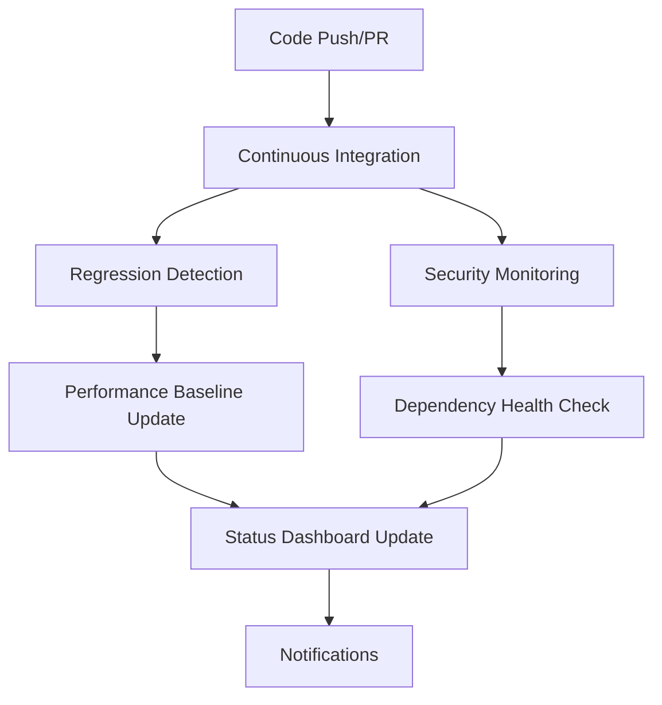

# CI/CD Infrastructure Documentation

## Overview

This document describes the comprehensive CI/CD infrastructure implemented for automated regression detection and prevention. The system ensures that all code changes are thoroughly tested before reaching production.

## Architecture

### Workflow Structure



## Workflows

### 1. Continuous Integration (`.github/workflows/ci.yml`)

**Triggers:**
- Push to `main` or `develop` branches
- Pull requests to `main` or `develop` branches

**Jobs:**
1. **Code Quality & Linting**
   - ESLint validation
   - TypeScript compilation check
   - Code formatting verification

2. **Unit Tests & Coverage**
   - Multi-Bun version testing (1.1.34, latest)
   - Coverage reporting with 70% threshold
   - Codecov integration
   - Coverage regression detection

3. **Build Application**
   - Next.js build verification
   - Build artifact collection

4. **E2E Tests**
   - Multi-browser testing (Chromium, Firefox, WebKit)
   - Mobile viewport testing
   - Screenshot and video capture on failure

5. **Performance Tests**
   - Lighthouse audits
   - Performance score validation (80+ threshold)
   - Core Web Vitals monitoring

6. **Security Audit**
   - bun audit for vulnerabilities
   - Dependency vulnerability scanning

7. **Accessibility Tests**
   - axe-playwright integration
   - WCAG compliance validation

8. **Test Results Summary**
   - Artifact aggregation
   - PR comment generation
   - GitHub Step Summary

### 2. Regression Detection (`.github/workflows/regression-detection.yml`)

**Triggers:**
- Push to `main` branch
- Pull requests to `main` branch
- Daily scheduled runs (2 AM UTC)

**Jobs:**
1. **Performance Regression Detection**
   - Lighthouse metrics comparison
   - Performance baseline maintenance
   - Threshold validation:
     - Performance score: 5% degradation max
     - FCP: 200ms increase max
     - LCP: 500ms increase max
     - TTI: 1000ms increase max
     - CLS: 0.05 increase max

2. **Coverage Regression Detection**
   - Test coverage comparison
   - 2% degradation threshold
   - Coverage baseline updates

3. **Bundle Size Regression Detection**
   - Build size monitoring
   - Static asset size tracking
   - Size increase thresholds:
     - Total build: 100KB max increase
     - Static assets: 50KB max increase

4. **Regression Report Generation**
   - Comprehensive metrics reporting
   - Trend analysis
   - PR comments with results

### 3. Dependency & Security Monitoring (`.github/workflows/dependency-security.yml`)

**Triggers:**
- Weekly schedule (Mondays 9 AM UTC)
- Changes to `package.json` or lock files
- Manual dispatch

**Jobs:**
1. **Security Vulnerability Scan**
   - bun audit with moderate+ severity
   - Snyk security scanning
   - Automated issue creation for vulnerabilities

2. **Dependency Update Check**
   - npm-check-updates integration
   - Major version update detection
   - Weekly update reports

3. **License Compliance Check**
   - License compatibility validation
   - Problematic license detection
   - Compliance reporting

4. **Dependency Health Check**
   - Outdated package detection
   - Bundle size impact analysis
   - Health score calculation

### 4. Status Dashboard (`.github/workflows/status-dashboard.yml`)

**Triggers:**
- Workflow completion events
- Hourly schedule
- Manual dispatch

**Features:**
- Real-time CI/CD health monitoring
- Success rate tracking
- Critical failure alerting
- Slack/email notifications
- Automated issue management

## Quality Gates

### Coverage Requirements
- **Minimum Coverage:** 70% for lines, functions, branches, and statements
- **Enforcement:** Build fails if coverage drops below threshold
- **Regression Detection:** 2% degradation triggers alerts

### Performance Thresholds
- **Lighthouse Performance Score:** 80+ required
- **First Contentful Paint:** <200ms degradation allowed
- **Largest Contentful Paint:** <500ms degradation allowed
- **Time to Interactive:** <1000ms degradation allowed
- **Cumulative Layout Shift:** <0.05 degradation allowed

### Security Standards
- **Vulnerability Tolerance:** No critical or high severity vulnerabilities
- **License Compliance:** No GPL or copyleft licenses
- **Dependency Health:** Regular updates and maintenance

## Local Development Integration

### Pre-commit Hooks (Husky)

**Setup:**
```bash
bun run setup-dev-env
```

**Hooks:**
1. **Pre-commit:**
   - Lint-staged file processing
   - TypeScript compilation check
   - Related test execution

2. **Commit-msg:**
   - Conventional commit validation
   - Message format enforcement

3. **Pre-push:**
   - Full test suite execution
   - Coverage threshold validation
   - Build verification

### Development Scripts

```bash
# Setup development environment
bun run setup-dev-env

# Run local test suite
bun run test-local

# Run with E2E tests
bun run test-local -- --e2e

# Watch mode testing
bun run test:watch

# Coverage reporting
bun run test:coverage
```

## Configuration Files

### Jest Configuration (`jest.config.js`)
- Next.js integration
- Coverage thresholds (70%)
- Test environment setup
- Module path mapping

### Playwright Configuration (`playwright.config.ts`)
- Multi-browser testing
- CI-specific settings
- Screenshot/video capture
- Retry logic

### Security Configuration (`.audit-ci.json`)
- Vulnerability severity levels
- Allowlist management
- Retry configuration

## Monitoring and Alerting

### Dashboard Features
- Real-time workflow status
- Success rate tracking
- Health indicators
- Quick action links

### Alert Conditions
- **Critical:** <50% success rate
- **Warning:** <75% success rate
- **Performance:** Regression thresholds exceeded
- **Security:** New vulnerabilities detected

### Notification Channels
- GitHub Issues (automated)
- Slack webhooks (optional)
- Email notifications (optional)

## Maintenance

### Regular Tasks
1. **Weekly:** Review dependency updates
2. **Monthly:** Update baseline metrics
3. **Quarterly:** Review and update thresholds
4. **As needed:** Address security vulnerabilities

### Baseline Updates
- Performance baselines update automatically on main branch
- Coverage baselines update with successful builds
- Bundle size baselines track with releases

### Troubleshooting

#### Common Issues

**Test Failures:**
1. Check test logs in GitHub Actions
2. Run tests locally: `bun run test-local`
3. Verify environment setup
4. Check for flaky tests

**Performance Regressions:**
1. Review Lighthouse reports
2. Compare with baseline metrics
3. Identify performance bottlenecks
4. Optimize critical rendering path

**Coverage Drops:**
1. Identify uncovered code
2. Add missing tests
3. Review test quality
4. Update coverage exclusions if needed

**Security Vulnerabilities:**
1. Run `bun audit --fix`
2. Update vulnerable dependencies
3. Find alternative packages if needed
4. Document exceptions if unavoidable

## Best Practices

### Code Quality
- Follow conventional commit messages
- Maintain test coverage above 70%
- Write meaningful test descriptions
- Use descriptive variable names

### Performance
- Monitor Core Web Vitals
- Optimize bundle size
- Use performance budgets
- Regular performance audits

### Security
- Keep dependencies updated
- Regular security scans
- Follow security best practices
- Document security decisions

### Testing
- Write tests before code (TDD)
- Test edge cases and error conditions
- Use meaningful test data
- Maintain test isolation

## Environment Variables

### Required Secrets
```bash
# Optional: Enhanced security scanning
SNYK_TOKEN=your_snyk_token

# Optional: Notifications
SLACK_WEBHOOK_URL=your_slack_webhook
SENDGRID_API_KEY=your_sendgrid_key
NOTIFICATION_EMAIL=alerts@yourcompany.com

# Automatic: GitHub token (provided by Actions)
GITHUB_TOKEN=automatically_provided
```

### Environment Setup
```bash
# Test database
DATABASE_URL=file:./test.db

# Authentication (testing)
NEXTAUTH_SECRET=test-secret-key-for-ci
NEXTAUTH_URL=http://localhost:3000
```

## Metrics and KPIs

### Success Metrics
- **Build Success Rate:** >95%
- **Test Coverage:** >70%
- **Performance Score:** >80
- **Security Vulnerabilities:** 0 critical/high
- **Mean Time to Recovery:** <2 hours

### Tracking
- GitHub Actions insights
- Custom dashboard metrics
- Performance trend analysis
- Security posture monitoring

## Support and Resources

### Documentation
- [GitHub Actions Documentation](https://docs.github.com/en/actions)
- [Jest Testing Framework](https://jestjs.io/docs/getting-started)
- [Playwright E2E Testing](https://playwright.dev/docs/intro)
- [Lighthouse Performance](https://developers.google.com/web/tools/lighthouse)

### Internal Resources
- `CI_CD_DASHBOARD.md` - Real-time status
- `tests/README.md` - Testing guidelines
- `scripts/` - Utility scripts
- GitHub Issues - Bug tracking and alerts

---

*This documentation is maintained automatically and updated with infrastructure changes.*